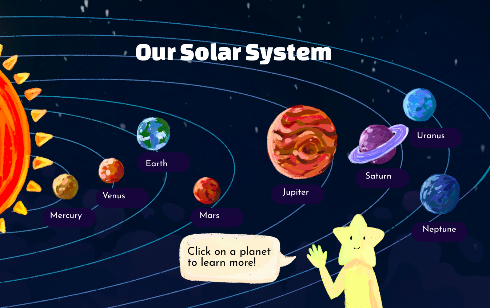

# System Solar

## Add your files

- push an existing Git repository with the following command:

```
git remote add origin git@github.com:MarcosYH/system-solar.git
git branch -M main
git push -u origin mai
```

## Description

The System Solar website is an interactive and educational platform that provides detailed information about the planets in our solar system. Users can explore each planet through engaging visuals, 3D models, and comprehensive data on distance from the sun, average temperature, and radius. The site aims to enhance learning and curiosity about our solar system with a user-friendly interface and visually appealing design.

## Visuals



## License

For open source projects, say how it is licensed.
